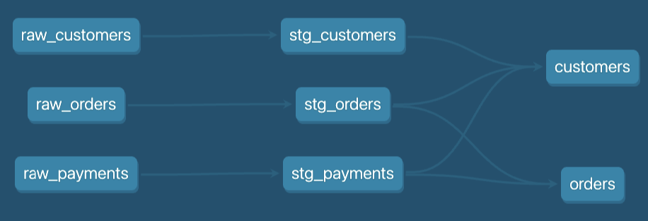

# DBT Column Lineage Extractor - Example Input Files

This directory contains two example files that are generated from the [jaffle_shop](https://github.com/dbt-labs/jaffle-shop-classic) dbt project, with the following model lineage:


## Required Files

The following files are necessary to run the DBT Column Lineage Extractor:

- **`catalog.json`**: This file provides the schema of the models, including the names and types of the columns.
- **`manifest.json`**: This file provides model-level lineage information.

Both of these files are generated by executing the command:

```bash
dbt docs generate
```

## Important Notes

- The `dbt docs generate` command does not parse your SQL syntax. Instead, it connects to the data warehouse to retrieve schema information.
- To ensure that the necessary schema information is available, you must have the models of interest materialized in your dbt project as either tables or views.
- If you don't have all the models materialized in your development environment, you might want to use the `--target` flag to specify an alternative target environment that has all the models materialized (e.g. `--target prod`), provided you have access to it.
- If you have modified the schemas of your models, make sure to update the materialized models in your warehouse to reflect these changes before running the `dbt docs generate` command.
