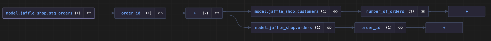

# DBT Column Lineage Extractor

# DISCLAIMER

**WARNING:** This tool is currently in beta and has only been tested on a limited number of dbt projects using the `snowflake` dialect. It might not perform as expected in every situation. Please report any issues or suggestions in the [Repository](https://github.com/canva-public/dbt-column-lineage-extractor)


## Overview

The DBT Column Lineage Extractor is a lightweight Python-based tool for extracting and analyzing data column lineage for dbt projects. This tool utilizes the [sqlglot](https://github.com/tobymao/sqlglot) library to parse and analyze SQL queries defined in your dbt models and maps their column lineage relationships.

## GitHub Repository
[dbt Column Lineage Extractor](https://github.com/canva-public/dbt-column-lineage-extractor)

## Features

- Extract column level lineage for specified model columns, including direct and recursive relationships.
- Output results in a human-readable JSON format, which can be programmatically integrated for use cases such as data impact analysis, data tagging, etc.; or visualized with other tools.


## Installation
### pip installation
```
pip install dbt-column-lineage-extractor
```

## Required Input Files

To run the DBT Column Lineage Extractor, you need the following files:

- **`catalog.json`**: Provides the schema of the models, including names and types of the columns.
- **`manifest.json`**: Offers model-level lineage information.

These files are generated by executing the command:

```bash
dbt docs generate
```

### Important Notes

- The `dbt docs generate` command does not parse your SQL syntax. Instead, it connects to the data warehouse to retrieve schema information.
- Ensure that the relevant models are materialized in your dbt project as either tables or views for accurate schema information.
- If the models aren't materialized in your development environment, you might use the `--target` flag to specify an alternative target environment with all models materialized (e.g., `--target prod`), given you have access to it.
- After modifying the schemas, update the materialized models in your warehouse before running the `dbt docs generate` command.


## Example Usage and Customization

The DBT Column Lineage Extractor can be used in two ways: via the command line interface or by integrating the Python scripts into your codebase.
```bash
cd examples
```

### Option 1 - Command Line Interface

First, generate column lineage relationships to model's direct parents and children using the `dbt_column_lineage_direct` command, e.g.:
```bash
dbt_column_lineage_direct --manifest ./inputs/manifest.json --catalog ./inputs/catalog.json
```
Then analyze recursive column lineage relationships for a specific model and column using the `dbt_column_lineage_recursive` command, e.g.:
```bash
dbt_column_lineage_recursive --model model.jaffle_shop.stg_orders --column order_id
```

See more usage guides using `dbt_column_lineage_direct -h` and `dbt_column_lineage_recursive -h`.

### Option 2 - Python Scripts
See the [readme file](./examples/readme.md) in the `examples` directory for more detailed instructions on how to integrate the DBT Column Lineage Extractor into your python scripts.

##### Example Outputs

- `seed.jaffle_shop.raw_orders -- id`
  - Structured Ancestors:
    ```json
    {}
    ```
  - Structured Descendants:
    ```json
    {
      "model.jaffle_shop.stg_orders": {
         "order_id": {
               "+": {
                  "model.jaffle_shop.customers": {
                     "number_of_orders": {
                           "+": {}
                     }
                  },
                  "model.jaffle_shop.orders": {
                     "order_id": {
                           "+": {}
                     }
                  }
               }
         }
      }
    }
    ```

- `model.jaffle_shop.stg_orders -- order_id`
  - Structured Ancestors:
    ```json
    {
      "seed.jaffle_shop.raw_orders": {
         "id": {
               "+": {}
         }
      }
    }
    ```
  - Structured Descendants:
    ```json
    {
      "model.jaffle_shop.customers": {
         "number_of_orders": {
               "+": {}
         }
      },
      "model.jaffle_shop.orders": {
         "order_id": {
               "+": {}
         }
      }
    }
    ```

## Example Visualization

The structured JSON outputs can be used programmatically, or loaded into visualization tools like [jsoncrack.com](https://jsoncrack.com/editor) to visualize the column lineage relationships and dependencies.


## Limitations
- Doesn’t support parse certain syntax, e.g. lateral flatten
- Doesn’t support dbt python models
- Only tested with `snowflake` dialect so far

